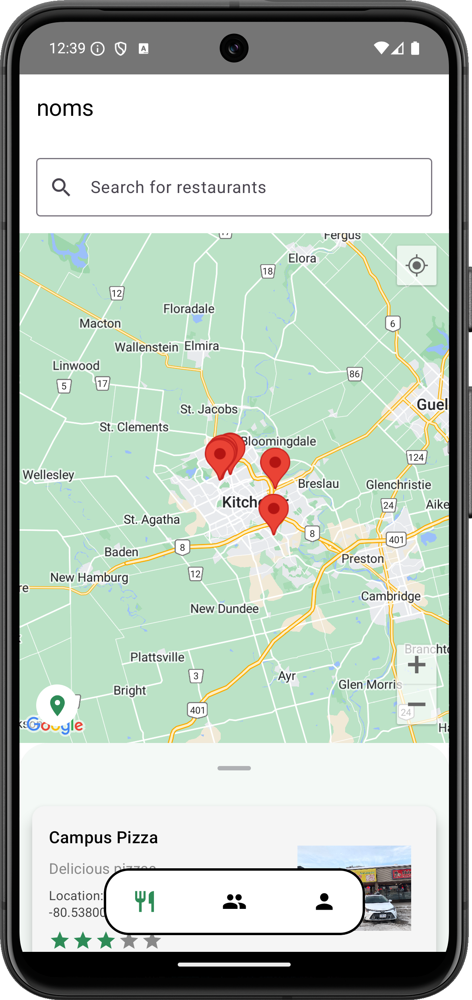
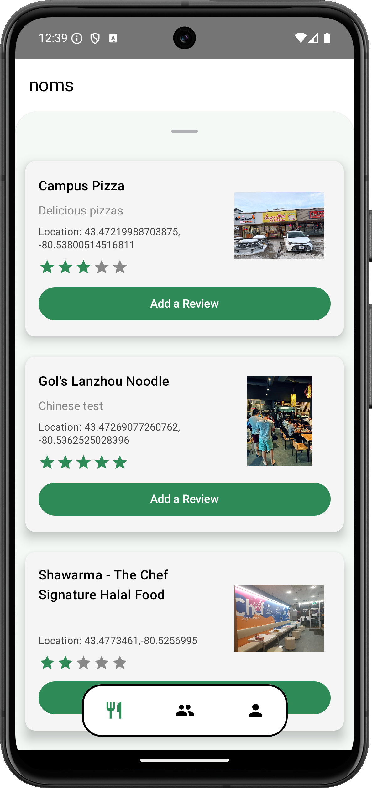
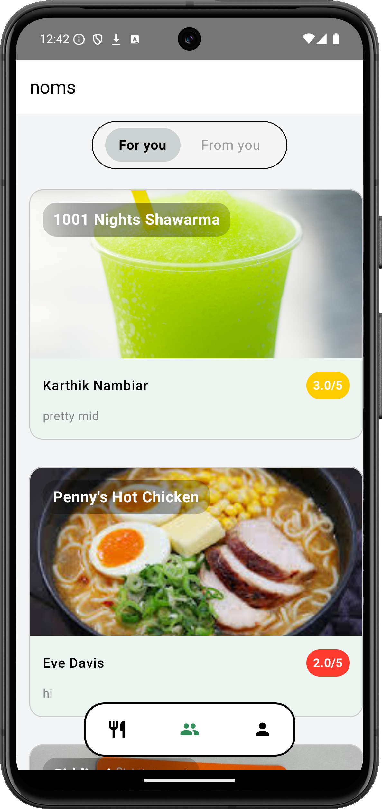
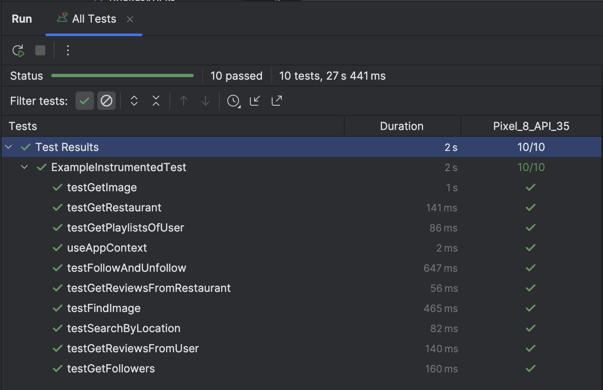

# noms

**Product Title:** noms

**Platform Definition:** Android/mobile

**Description:** *noms* is a personalized app that helps users discover and connect with meaningful restaurant experiences based on their unique preferences and nearby location. Some key features include following friends, writing restaurant reviews, and creating restaurant playlists.

# Demo

	

# Screenshots

	
	
	
	

# Videos

# Team Members
- Ahmed Ahmed (ah4ahmed@uwaterloo.ca)
- Vivek Bhardwaj (v24bhard@uwaterloo.ca)
- Aiden Ramgoolam (aaramgoo@uwaterloo.ca)
- Karthik Nambiar (k3nambia@uwaterloo.ca)

# Documents

- [Team Contract](https://git.uwaterloo.ca/v24bhard/team-101-15/-/wikis/Team-Contract)
- [Project Proposal](https://git.uwaterloo.ca/v24bhard/team-101-15/-/wikis/Project-Proposal)
- [Design Proposal](https://git.uwaterloo.ca/v24bhard/team-101-15/-/wikis/Design-Proposal)
- [Meeting Minutes](https://git.uwaterloo.ca/v24bhard/team-101-15/-/wikis/Sprint-1-meeting-minutes---M4)
- [User Documentation](https://git.uwaterloo.ca/v24bhard/team-101-15/-/wikis/User-documentation)
- [Project Reflections](https://git.uwaterloo.ca/v24bhard/team-101-15/-/wikis/Project-reflections)
- [Design Diagrams](https://git.uwaterloo.ca/v24bhard/team-101-15/-/wikis/Design-diagrams)

# Releases and Installer's
- [Release Version 1.0](https://git.uwaterloo.ca/v24bhard/team-101-15/-/wikis/Version-1.0-Release)
- [Release Version 2.0](https://git.uwaterloo.ca/v24bhard/team-101-15/-/wikis/Version-2.0-Release)
- [Release Version 3.0](https://git.uwaterloo.ca/v24bhard/team-101-15/-/wikis/Version-3.0-Release)
- [Final - Release Version 4.0](https://git.uwaterloo.ca/v24bhard/team-101-15/-/releases/Final)

The *noms* APK can be installed here: [**APK Installer**](https://git.uwaterloo.ca/v24bhard/team-101-15/-/blob/main/app/release/app-release.apk?ref_type=heads)

# Unit Tests
We've created unit tests for all the core MVVM parts of our app, and this can be tested by going to android studio and clicking `Run All Tests`, which will result in the following success output:

